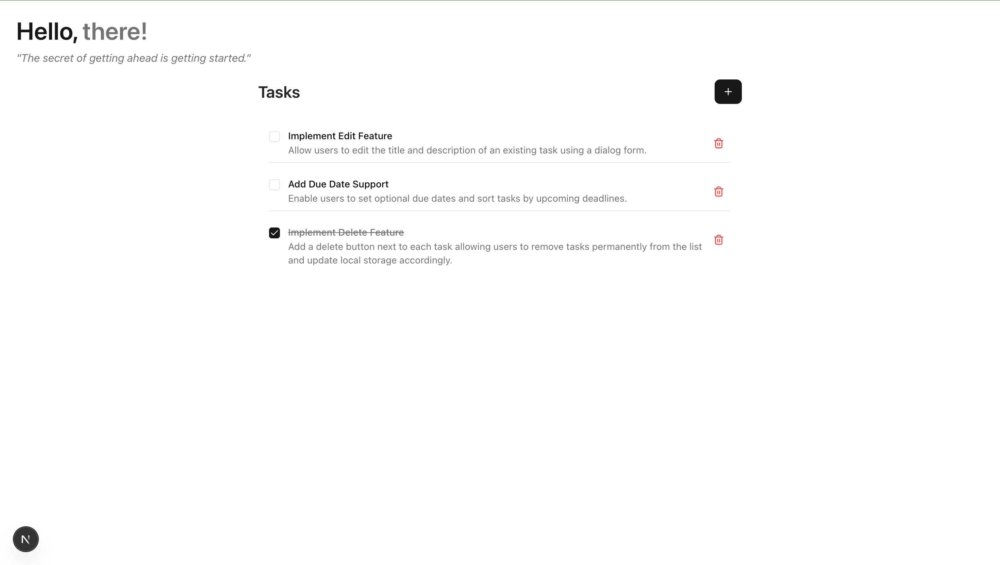
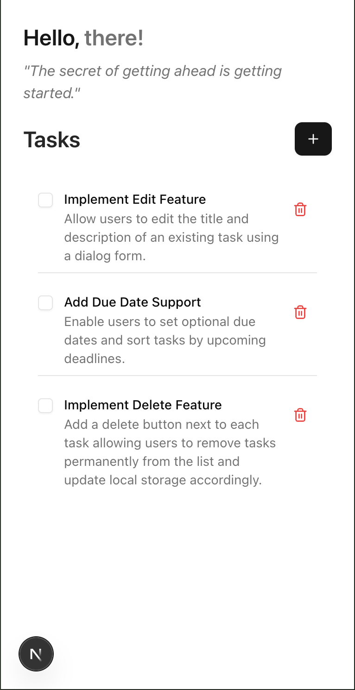

# 📝 Dainwi Todo

### *A modern, minimal task management experience*


*Zero backend • Instant sync • Beautiful interface*

[📱 Live Demo](https://your-demo-link.com) • [🐛 Report Bug](https://github.com/iamdanwi/todo-app/issues) • [✨ Request Feature](https://github.com/iamdanwi/todo-app/issues)


---

## ✨ **What makes it special**

Dainwi Todo isn't just another task app. It's crafted with attention to detail, leveraging modern web technologies to deliver a seamless experience that works entirely in your browser.

### 🎯 **Core Features**

```
🏗️  Add tasks with rich descriptions
✅  One-click completion with visual feedback  
💾  Automatic local storage persistence
📱  Mobile-first responsive design
🎨  Clean, modern interface with ShadCN components
⚡  Lightning-fast performance with Next.js
```

---

## 🛠️ **Tech Stack**

<div align="center">

| Technology | Purpose | Version |
|------------|---------|---------|
| **Next.js** | React Framework | 15.0+ |
| **React** | UI Library | 18.0+ |
| **TypeScript** | Type Safety | 5.0+ |
| **Tailwind CSS** | Styling | 3.4+ |
| **ShadCN/UI** | Component Library | Latest |
| **localStorage** | Data Persistence | Browser API |

</div>

**Why These Technologies?**
- **Next.js:** Server-side rendering and optimal performance
- **TypeScript:** Enhanced developer experience with type safety
- **Tailwind CSS:** Utility-first CSS for rapid development
- **ShadCN/UI:** Beautiful, accessible components out of the box

---

## 🚀 **Quick Start**

### Prerequisites
- **Node.js** 18+ 
- **npm** or **yarn**

### Installation

```bash
# 1️⃣ Clone the repository
git clone https://github.com/iamdanwi/todo-app.git
cd todo-app

# 2️⃣ Install dependencies
npm install
# or
yarn install

# 3️⃣ Start development server
npm run dev
# or  
yarn dev
```

🎉 **That's it!** Open [`http://localhost:3000`](http://localhost:3000) and start managing your tasks.

---

## 📂 **Project Architecture**

```
todo-app/
├── 📁 app/
│   ├── layout.tsx          # Root layout
│   ├── page.tsx           # Main todo interface
│   └── globals.css        # Global styles
├── 📁 components/
│   └── ui/               # ShadCN components
│       ├── button.tsx
│       ├── input.tsx
│       ├── checkbox.tsx
│       └── ...
├── 📁 lib/
│   └── utils.ts          # Utility functions
├── 📁 public/            # Static assets
├── tailwind.config.js    # Tailwind configuration
└── package.json         # Dependencies
```

---

## 💡 **How to Use**

### Adding Tasks
1. **Enter a title** in the main input field
2. **Add description** (optional) for context
3. **Click "Add Task"** or press `Enter`

### Managing Tasks
- **✅ Complete:** Click the checkbox to mark done
- **👁️ View:** Scroll through your task list
- **💾 Auto-save:** Everything saves automatically

> **💡 Pro tip:** Your tasks persist across browser sessions thanks to localStorage!

---

## 🎨 **Preview**
 >
 
 
 

**Key Interface Elements:**
- ✨ Clean, minimal design with smooth animations
- 📱 Fully responsive layout (mobile-first approach)
- 🎯 Intuitive task completion with visual feedback
- 🎨 Modern UI components powered by ShadCN

---

## 🔮 **Roadmap**

We're constantly improving Dainwi Todo. Here's what's coming:

- [x] **🗑️ Task deletion** — Remove completed tasks
- [ ] **✏️ Edit mode** — Modify existing tasks  
- [ ] **🏷️ Categories** — Organize with tags
- [ ] **📅 Due dates** — Time-based organization
- [ ] **🌙 Dark mode** — Easy on the eyes
- [ ] **☁️ Cloud sync** — Cross-device synchronization
- [ ] **📊 Analytics** — Productivity insights

---

## 🤝 **Contributing**

Contributions make the open source community amazing! Any contributions are **greatly appreciated**.

```bash
# 1. Fork the project
# 2. Create your feature branch
git checkout -b feature/AmazingFeature

# 3. Commit your changes  
git commit -m 'Add some AmazingFeature'

# 4. Push to the branch
git push origin feature/AmazingFeature

# 5. Open a Pull Request
```

---

## 📄 **License**

Distributed under the **MIT License**. See `LICENSE` for more information.

---

<div align="center">

## 👨‍💻 **Author**

**Dainwi Kumar**

[](https://github.com/iamdanwi)
[](https://linkedin.com/in/your-profile)
[](https://twitter.com/your-handle)

---

### ⭐ **Star this repo if it helped you!**

*Made with ❤️ for the developer community*
